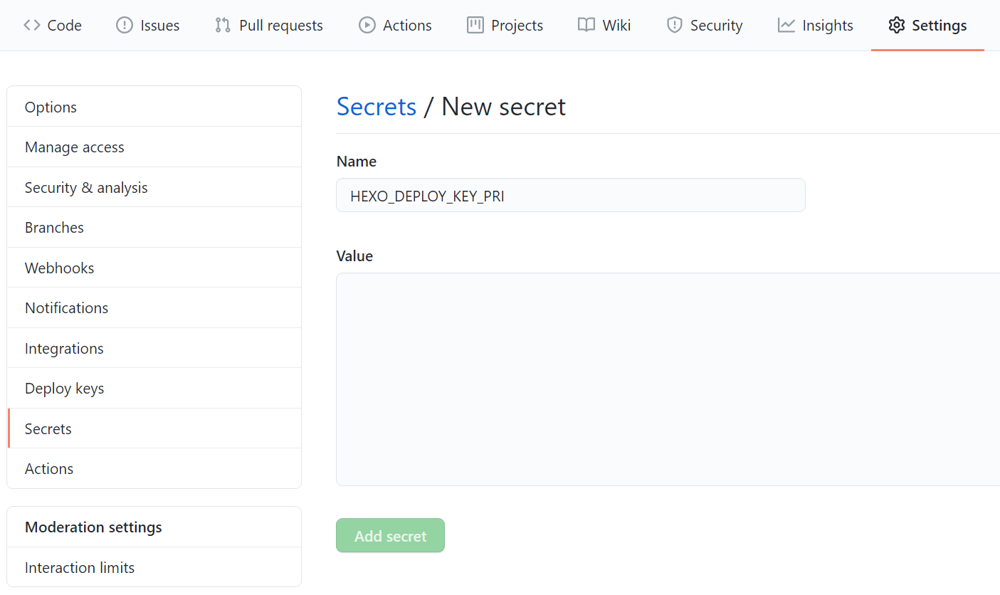
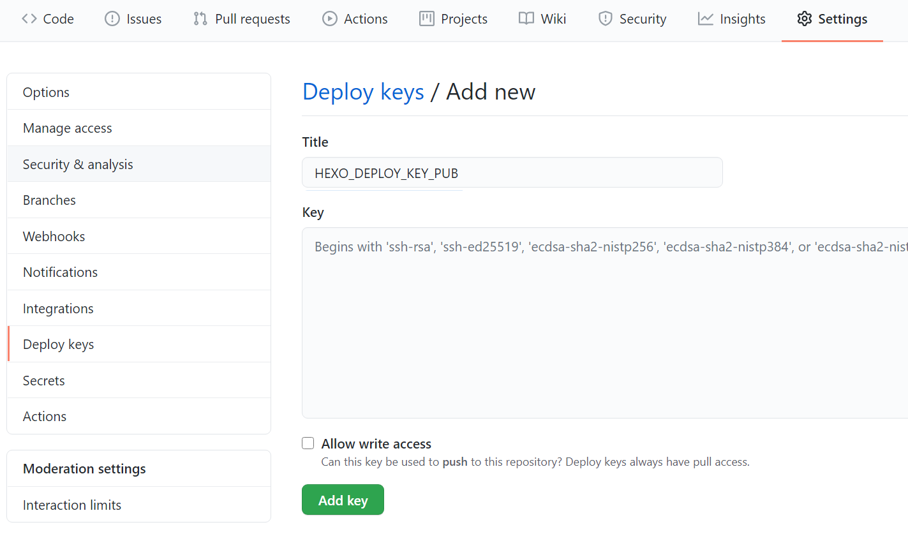

## 介绍

[GitHub Actions](https://docs.github.com/cn/free-pro-team@latest/actions) 是类似于 [Travis CI](https://travis-ci.org/) 、 [Circle CI](https://circleci.com/) 这样的持续集成服务， 是由 GitHub 官方推出的持续集成服务，可以帮助我们完成一些自动化测试、打包、部署等操作。


这篇文章将介绍使用 GitHub Actions 一步一步实现 Hexo Blog 自动化构建部署到 GitHub Pages 的流程，关于 Hexo 博客搭建的过程这里不会讲述，自行查阅相关资料文档。

GitHub Actions 中的术语:

- `workflow` 表示一次持续集成的过程
- `job` 表示构建任务，一个 workflow 可以由一个或者多个 job 组成，可支持并发执行多个 job
- `step` 一个 job 由一个或多个 step 组成，按顺序依次执行
- `action` 每个 step 由一个或多个 action 组成，按顺序依次执行


## 准备

创建一个 `username.github.io` 的仓库，在这里采用的一个仓库多分支的方式，一个分支存放博客源码，主分支存放生成的网站静态资源。

### GitHub 秘钥配置

使用命令生成秘钥：

``` bash
ssh-keygen -f github-deploy-key
```

将创建好的 `github-deploy-key.pub` 文件中的内容复制添加到对应仓库的 Deploy keys 中， **Settings** / **Deploy keys** / **Add deploy key**， 取名为 `HEXO_DEPLOY_KEY_PUB`。

<!--  -->

将创建好的 `github-deploy-key` 文件中的内容复制添加到对应仓库的 Secrets 中， **Settings** / **Secrets** / **New Secret**，取名为 `HEXO_DEPLOY_KEY_PRI`。

<!--  -->


## Github Actions 脚本编写 

在仓库的 `.github/workflows/` 目录下创建一个 `hexo-auto-deploy-ci.yml` 文件，这个名字是可以随意取得。

我的 Actions 脚本如下：

``` yml
name: Hexo Auto Deploy CI

on:
  push:
    branches: [source]
  pull_request:
    branches: [source]

env:
  GIT_USER: iaosee
  GIT_EMAIL: iaosee@outlook.com
  THEME_REPO: izhaoo/hexo-theme-zhaoo
  THEME_BRANCH: master

jobs:
  build:
    name: Build on node ${{ matrix.node_version }} and ${{ matrix.os }}
    runs-on: ubuntu-latest
    strategy:
      matrix:
        os: [ubuntu-latest]
        node_version: [12.x]

    steps:
      - name: Checkout blog repo
        uses: actions/checkout@v2
        with:
          ref: source

      - name: Checkout theme repo
        uses: actions/checkout@v2
        with:
          repository: ${{ env.THEME_REPO }}
          ref: ${{ env.THEME_BRANCH }}
          path: themes/zhaoo

      - name: Use Node.js ${{ matrix.node_version }}
        uses: actions/setup-node@v1
        with:
          node-version: ${{ matrix.node_version }}

      - name: Configuration environment
        env:
          HEXO_DEPLOY_KEY_PRI: ${{secrets.HEXO_DEPLOY_KEY_PRI}}
        run: |
          sudo timedatectl set-timezone "Asia/Shanghai"
          mkdir -p ~/.ssh/
          echo "$HEXO_DEPLOY_KEY_PRI" > ~/.ssh/id_rsa
          chmod 600 ~/.ssh/id_rsa
          ssh-keyscan github.com >> ~/.ssh/known_hosts
          git config --global user.name $GIT_USER
          git config --global user.email $GIT_EMAIL
          cp _config.theme.zhaoo.yml themes/zhaoo/_config.yml

      - name: Install dependencies
        run: |
          npm i

      - name: Deploy blog
        run: |
          npm run clean
          npm run deploy

```


